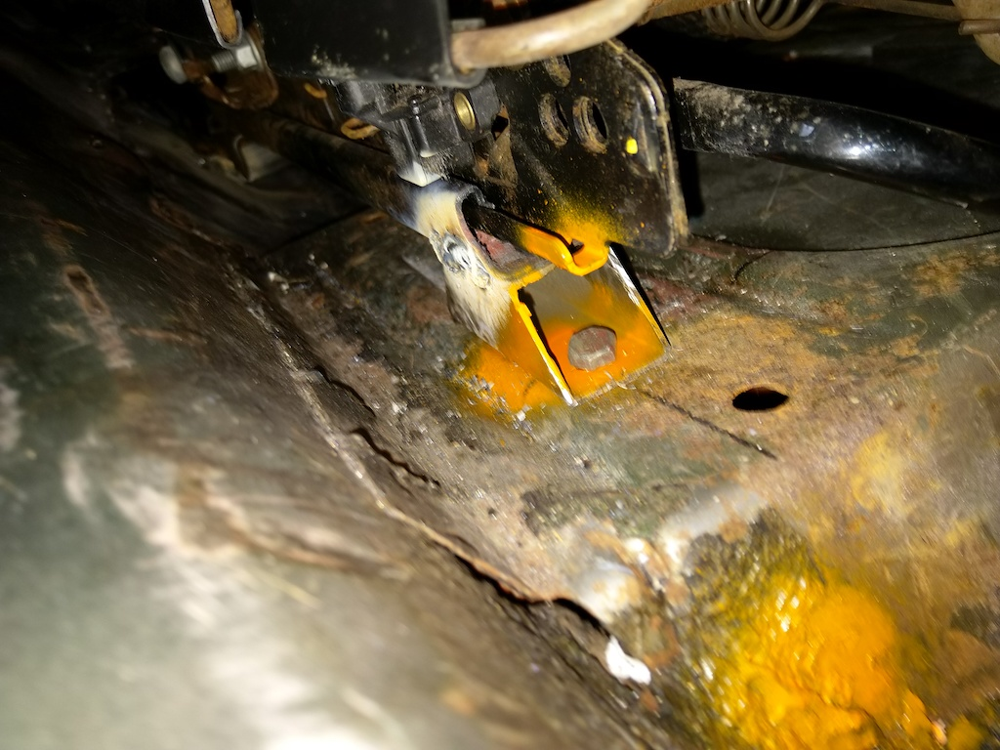

Interior smelled like there was some inter-species territory marking. Dont know what it was, but it was bad.  
Told my wife and asked her for advice. She said "sounds like urine trouble" and promptly left. She has tried to apologize, but I need more time.    

Tore everything out, washed with copious amounts of chemicals.  Didn't mean to remove the headliner, but it got torn up while I was trying to clean it so ended up having to remove it completely.  
Which was good cus it wasnt immune to the bad smells, but also bad because I then realized that this was gna pee a bigger job than I thought.

  
  
  
  

Turns out headliners are expensive. No worries. Got some insulating foam, spray-on adhesive, couple curtains and some corrugated plastic board.

  
  
  
  
  
  
  
  
  
  
  
  

With the headliner done, I wanted to do something about the seats. I initially just thought I'd wash them and re-upholster, but the seat frames were a bit rotten.  
Made a trip to the wreckers and got some fabric seats from a wrecked late model mustang. 

  

To make them fit, I welded some box steel into the rear footwells and added some studs. 

  
  
  
  
  
  
  
  
  

Also had to get rid of the angular mounts on the new seat rails and use a small piece of box steel to raise the front.

  
  
  
  

Made another trip to the wreckers and got a handbrake assembly from a foxbody mustang. 
The stock oldschool under-dash e-brake wasnt connected and was missing some linkages. Figured skids would be easier with something more... accessible.

  
  
  

Connecting it up wasnt too bad. I relocated the brackets holding the ebrake cables.

  

Used an old "drain snake" as guides for the cables
 
  
  

Rounded the slots on the ebrake spreader to accommodate the anchor bolts

 
  
  

New location for brackets
  

Next up was the gas pedal. It was missing the pad. Couldnt find a new one. Chopped up some leftover box steel.

  
  
  
  
  

Cleaned up the floor welds and installed brand new carpet. Used some grip-tape for pedal covers.

  
  
  
  
  

Got a cheap cupholder. Chopped it up, now its a handbrake cover.

  
  
  
  
  
  
  
  
  
  
  
  

This isnt exactly gna be a family car. Declined to re-install the rear seats. Made a cover for it instead.

  
  
  
  
  

All done. Much more comfortable. Steering wheel is a bit big, will look for something slightly smaller.  
No more bad smells.  
Hula dash doll has been with me since my first car.  
I'd like to renew the gauge cluster and dash, but that'll need to wait till I decide on engine upgrade/replacement.   

  
  
 